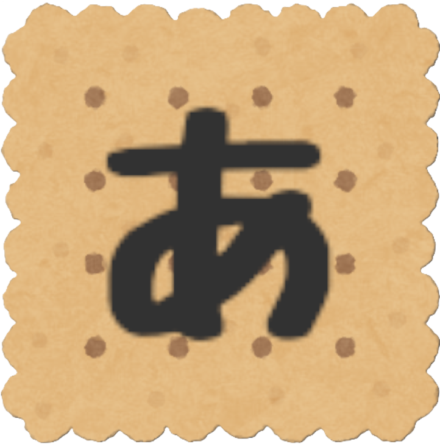
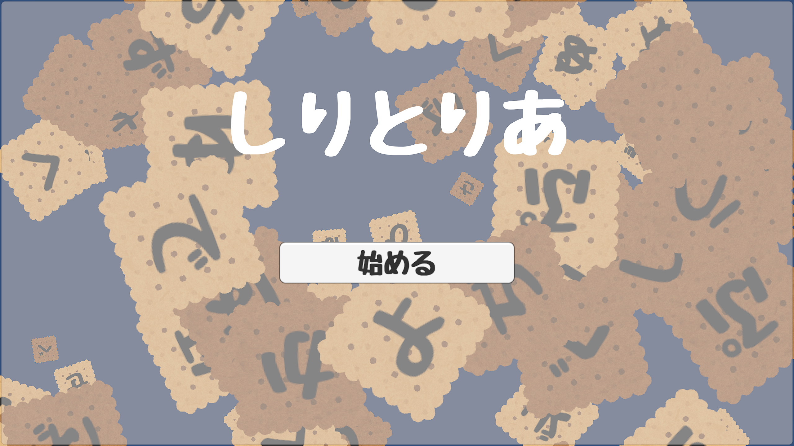
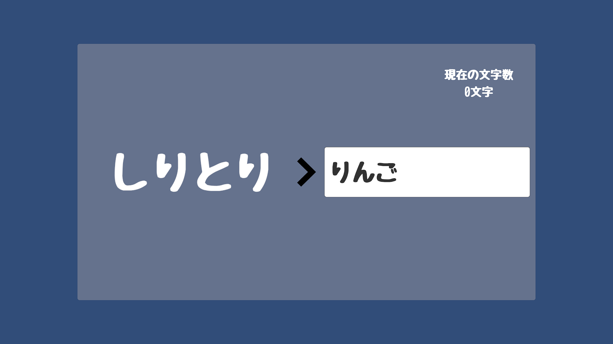
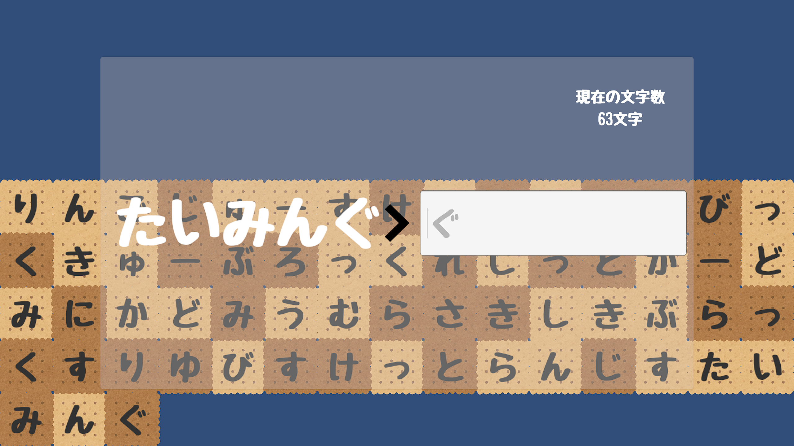
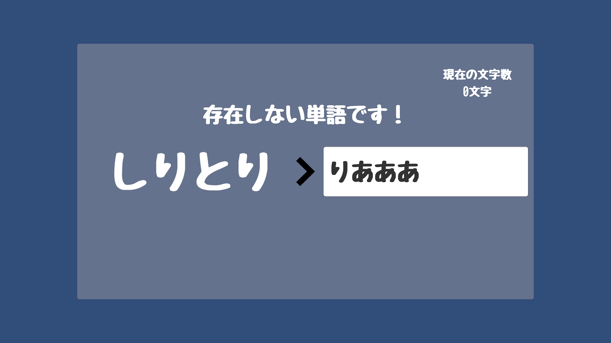
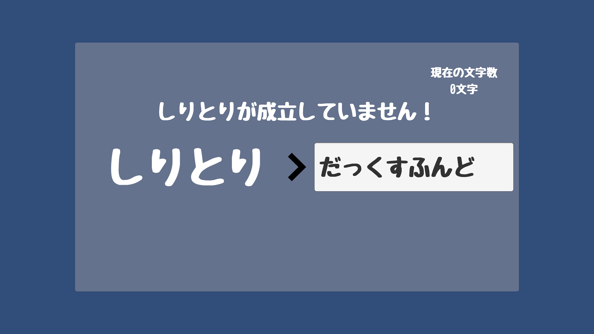
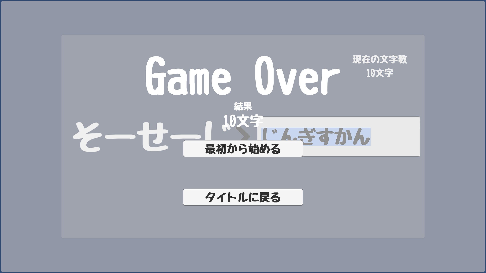
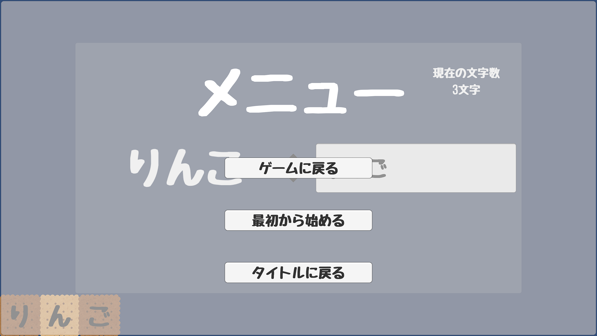

# Shiritoria

# 概要
　「しりとりあ」は，Unityで作成されたしりとりゲームです．

## タイトル画面

## しりとり
前の単語の最後の文字からつながるように単語を入力していきます．[jisho.org](https://jisho.org/)APIを使用し，単語の実在判定を行い，実在する単語のみ受け付ける仕様となっています．

## ひらがなビスケット
しりとりが成立すると背景にビスケットが溜まっていきます．ビスケットにはひらがなが書かれており，行ったしりとりがつながるように溜まっていきます．

## 終了/エラー
しりとりが成立していない，または存在しない単語の入力は弾かれます．

「ん」で終了する，または過去に使用した単語を入力したらゲームオーバーです．

## メニュー
ゲーム中はEscキーでメニューが開けます．

# 実行手順

https://github.com/Tyara-173/Shiritoria_Desktopをダウンロードし，Shiritoria.exeを実行してください．（Windows以外での動作確認はできておりません．）

# 参考にしたサイト
https://w.atwiki.jp/ultimate/pages/16.html 
https://note.com/5mingame2/n/n341823e433a3

# AIの使用について

Unityは過去にも使用していたため，基礎的な部分で詰まることは少なかったですが，単語の実在判定やAPIの利用などの部分はかなり手伝ってもらいました． 
実在判定についての質問：https://chatgpt.com/share/6858728a-f3a8-8000-bf8e-02b764ab3169 
httpリクエストについての質問：https://chatgpt.com/share/685872c0-05f0-8000-bad9-8c35bc7e8b5a 
タイトル画面の背景作成：https://gemini.google.com/share/6dd0f3f4ad41 

基本的にコードすべてのコピペは行わず，部分的な質問・コードの生成をお願いしていました．

# 使用素材
じゆうちょうフォント by よく飛ばない鳥様  
https://yokutobanaitori.web.fc2.com/  
 
いろいろなビスケットのイラスト 　by  いらすとや様  
https://www.irasutoya.com/2018/01/blog-post_258.html
